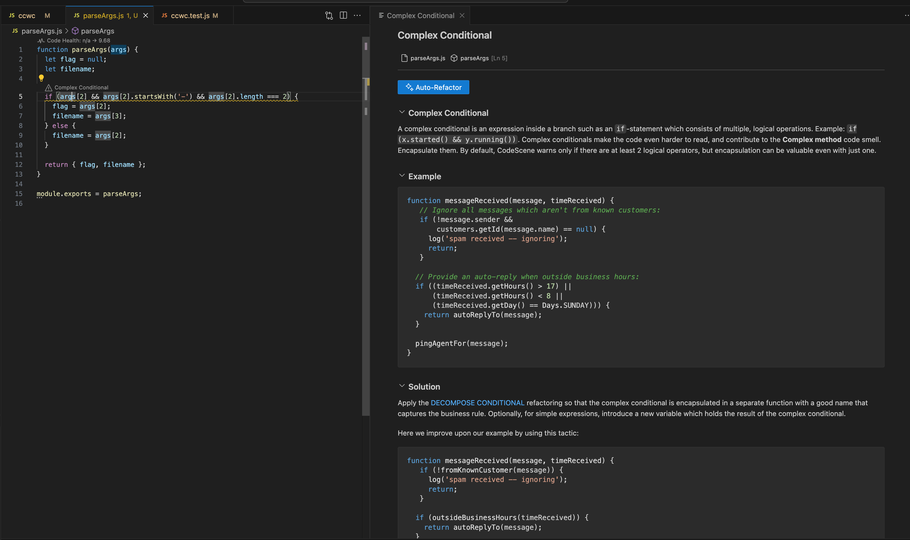
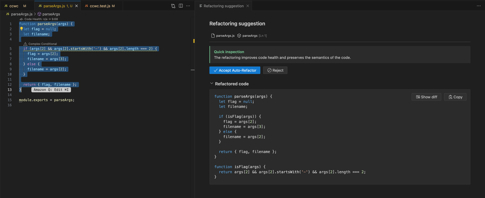

# Build Your Own WC Tool

An implementation of the Unix `wc` (word count) utility as part of the [Coding Challenges](https://codingchallenges.fyi/challenges/challenge-wc/) project.

## Features

- Counts bytes using Node.js's `stats.size`
- Counts lines, words, and characters in text files
- Supports command-line interface
- Fully tested implementation

## Technical Stack

- **Runtime**: Node.js
- **Testing**: Node.js built-in test runner
- **File Operations**: Node.js fs module

## Implementation Details

### Core Functionality
The main `wc` function is exported as a module to enable testing and reuse. It supports the following operations:
- `-c`: Count bytes
- `-l`: Count lines
- `-w`: Count words
- `-m`: Count characters

### CLI Implementation
The command-line interface is implemented using:
- Shebang (`#!/usr/bin/env node`) for Unix-like systems
- Proper executable permissions
- Command-line argument parsing

## Development

### Prerequisites
- Node.js (latest LTS recommended)

### Development Environment
You can use Flox to manage your development environment:

1. Install Flox from https://flox.dev/docs/install-flox/
1. Clone this repository
1. Run `flox activate` in the project folder, which will install Node for you.

### Testing
```bash
node --test
```

### Running
```bash
./ccwc [option] [file]
```

### Project structure
```
.
├── test/
│   ├── parseArgs.test.js
│   └── ccwc.test.js
├── ccwc.js        # Core implementation
├── parseArgs.js   # Pasrse command line arguments
├── test.txt       # Text file to validate solution
└── README.md
```

# Using AI Code Assistance
I used Amazon Q as a plug-in to VS Code. The flow I followed was to write tests, then implement a piece of functionality.

This was great until I needed to handle the default case `ccwc test.txt`. I needed to change the code which handled the command line input and write a test. To write a test, I wanted to extract the code block to a separate file. Amazon Q suggested a method, plus introduced third-party dependencies. Instead, I switched to Claude and got the following script, along with some tests:

```
function parseArgs(args) {
  let flag = null;
  let filename;

  if (args[2] && args[2].startsWith('-') && args[2].length === 2) {
    flag = args[2];
    filename = args[3];
  } else {
    filename = args[2];
  }

  return { flag, filename };
}
```

This worked.

I'd previously installed CodeScene's VS plug-in to tell me about code smells, which AI coding assistants are very guitly of. Code assistants are very capable producing correct code but it's often not easy to understand. This is where having CodeScene in the loop, which constantly monitors for code health, comes to the rescue.

Here, CodeScene noticed a complex conditional:


And here's the refacting CodeScene suggested and I accepted:


Watch [Adam Tornhill's talk](https://www.youtube.com/watch?v=9ciQx0k2bXM) for more info about the value of pairing code quality tools with AI coding assitants to appreciate the value this brings.
